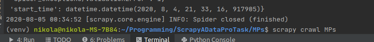
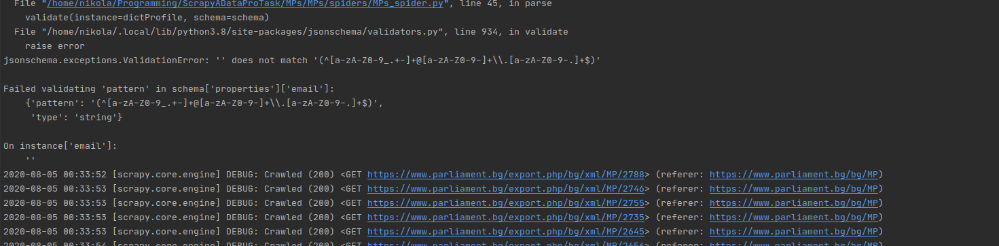
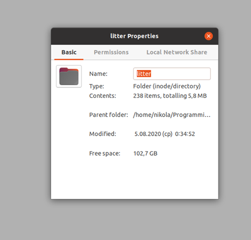
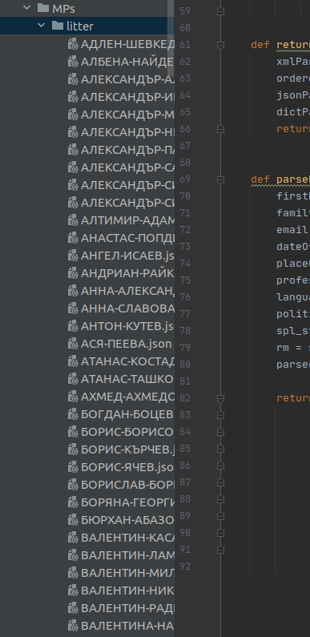

Data Extraction with Scrapy (Python)
===================

- - - - 
# Heading 1 #

    Download the repo, open it and navigate to the MPs dir "cd MPs" then run the following command "scrapy crawl MPs"
    

